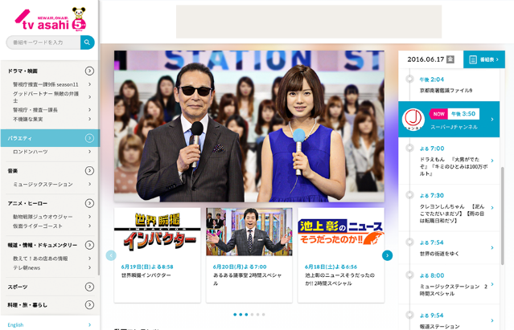
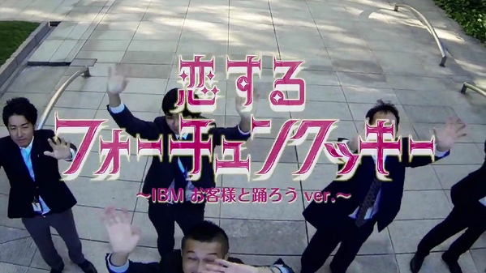
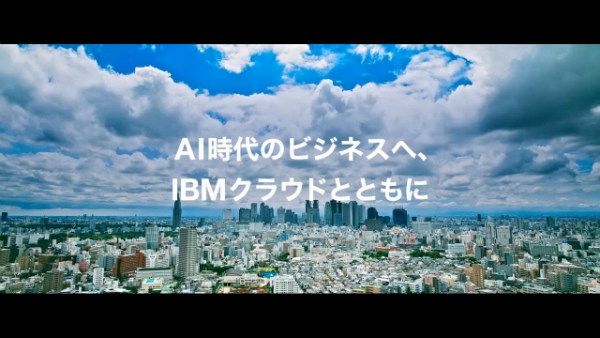
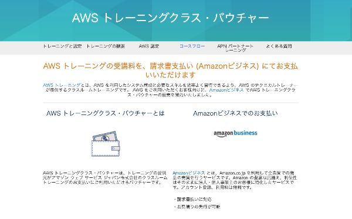
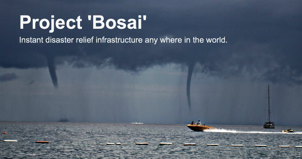

<!-- ### Sou Ebina
　　-->
<!--
## Sou Ebina's skills summary  

- 11 years experience in B2B Tech Marketing 
  * Marketing Strategies & Campaigns  
  * Product Positioning & Branding  
  * New Product Launch  
  * Signature event project management
  * Web Development : HTML, CSS, Bootstrap, JavaScript, jQuery, SQL, git, GitHub, Heroku and Ruby on Rails 
- 2 years experience in Technical Sales
- 8 years experience in Server Control Engineering and web-based applications development  
  _Languages:_ C, C++, Java, PHP, Perl  
  _Databases:_ Oracle, PostgreSQL  
  _Systems:_ Unix, Linux, Windows, Apache Tomcat
 -->

## Works (2000 - 2018)

[Digital Network MP3 Test-Listening System](http://www.atmarkit.co.jp/flinux/jirei/pioneer/pioneer_jirei.html)
(2000)  
  

- _Role:_ Server-Side Application development
- _Objectives:_ Introduced and operated new computerized system for Digital Network MP3 test-listening service with Pioneer Corporation.  
- _Results:_ The Japan first large-scale system development reference to adapt Linux as primary operating system for mission critical system.

[TV-Asahi corp. CMS renewal project](http://www.itmedia.co.jp/enterprise/articles/0503/22/news118.html)
(2004)  
  

- _Role:_ Application Development Team Leader
- _Objectives:_ Project aimed to integrate digital data broadcasting system with an existing web site,scattered customer data as well.  
- _Results:_ Whole system was safely launched in June 2004 with flexibility and agility.The first case in Japanese B2C website to adapt PHP for primary language.

[Oracle OpenWorld Tokyo 2012](http://www.fujitsu.com/jp/products/computing/servers/unix/sparc-enterprise/events/oracle-ow/2012/correspondent/)
(2012)  
  

- _Role:_ Project Manager
- _Objectives:_ Promote Oracle Japan Business vision and brand leadership through 3 Day Conference.The world's first conference that connects Tokyo and Kyoto via satellite.
- _Results:_ 15,000+ attendees with 100 Direct Opportunities,$35M business pipeline

[Watch funny videos!](https://www.youtube.com/watch?v=QOyrynZq_0I/)  

[“Fortune Cookie in Love” video promotion](https://www.youtube.com/watch?v=URLrRwlu6qI)
(2013)  
  

- _Role:_ Producer/Project Manager
- _Objectives:_ Develop new/deeper relationship with IT startup company’s Executives through new and novel approach, to create new demand and revenue opportunities in white market.
- _Results:_ No.3 Total PV ranking in IBM Japan (942,584 PVs/as of Mar8,2017)

[Watson on IBM Cloud Digital promotion](https://www.ibm.com/cognitive/jp-ja/cloud-for-cognitive/)
(2016-2017)   
  

- _Role:_ Project Manager
- _Objectives:_ Promote Watson and IBM Cloud Business vision and brand leadership through integrated digital campaign.The first large-scale collaboration with the publicity team to make large impact to the market.
- _Results:_ Effectively formulates strategies, tactics, and action plans to drive results. Exceeded the original goal of Web visits to campaign landing page by 140% (data as of Mar23,2017)  

[AWS training Voucher on Amazon Business Marketplace](https://aws.amazon.com/jp/training/voucher/)
(2018-)   
  

- _Role:_ Project Manager
- _Objectives:_ Aim to help customers who cannot purchase the voucher by invoice. AWS customers can get more convenience for AWS training payment by purchasing the voucher on Amazon Business Marketplace.
- _Results:_ Through Amazon Business Marketplace, customers can purchase the voucher by invoice from one day course with one participant. Also customers can get a quote automatically from the system immediately. Amazon Business Marketplace give customers not only flexibility in buying vouchers but also reducing costs and saving time.

## Social Action Work    
[Project 'Bosai'](https://www.bosai.world/)
(2017-)   
  

- _Role:_ Product Manger, UI/UX Designer
- _Background:_ Shipped to production as a pilot project after 9-week intensive coding bootcamp learning HTML, CSS, Bootstrap, JavaScript, jQuery, SQL, git, GitHub, Heroku and Ruby on Rails
- _Description:_ Instant community based Disaster Relief Infrastructure aim to solve the inefficiency in the distribution of relief supplies and aid in the aftermath of catastrophic disasters, leading to severe "secondary disasters" 

[LinkedIn](https://www.linkedin.com/in/sosuke-ebina/)  

<!-- ga beacon -->

